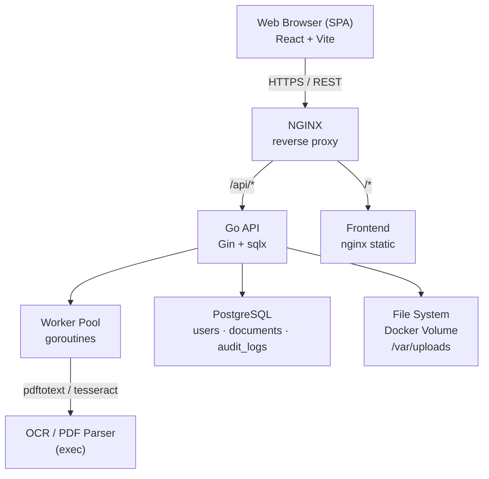

# Arquitetura do Sistema

## Diagrama Final

## O que mudou em relação ao rascunho v1.3

O diagrama original (v1.3 DRAFT) propunha uma arquitetura consideravelmente mais complexa. Abaixo estão as mudanças feitas e a justificativa de cada uma.

### 1. Três bancos de dados → PostgreSQL único

**Original:** MongoDB (metadados de documentos) + PostgreSQL (usuários) + MySQL (relatórios), com joins feitos no código da aplicação.

**Mudança:** Um único PostgreSQL para tudo.

**Motivo:** Manter três bancos de dados distintos é um anti-pattern clássico: gera inconsistência transacional, dificulta joins e triplica a carga operacional. O PostgreSQL suporta JSONB para metadados flexíveis e `tsvector` para busca textual, eliminando a necessidade dos outros dois bancos.

### 2. Elasticsearch (cluster de 3 nós) → tsvector do PostgreSQL

**Original:** Elasticsearch marcado como "mandatory" com cluster de 3 nós para full-text search.

**Mudança:** Busca textual via `tsvector`/`tsquery` do próprio PostgreSQL.

**Motivo:** Para a escala de 5.000 documentos/dia, um índice GIN com `tsvector` tem desempenho mais que suficiente. Um cluster Elasticsearch de 3 nós representa um custo operacional desproporcional ao problema.

### 3. RabbitMQ → Worker pool com goroutines

**Original:** RabbitMQ listado como "optional / evaluate necessity".

**Mudança:** Pool de goroutines com canal Go para enfileirar jobs de OCR.

**Motivo:** O volume projetado (5.000 docs/dia ≈ 0,06 doc/s) não justifica um message broker externo. Um pool de 4 workers com canal bufferizado é suficiente e elimina uma dependência de infraestrutura.

### 4. Processamento OCR síncrono → assíncrono com polling

**Original:** OCR era invocado de forma síncrona na requisição HTTP.

**Mudança:** Upload retorna imediatamente com status `pending`; frontend faz polling do status.

**Motivo:** OCR pode levar de 10 a 30 segundos por documento. Manter a conexão HTTP aberta durante esse tempo causa timeouts no cliente e no proxy.

### 5. Schema XML indefinido → schema definido e documentado

**Original:** O diagrama referenciava "enriquecimento XML" sem definir o schema.

**Mudança:** Schema XML definido e documentado (ver `docs/xml-schema.md`), com validação programática no backend.

**Motivo:** Sem um schema definido, a integração entre sistemas que enviam XMLs seria impossível de garantir.
